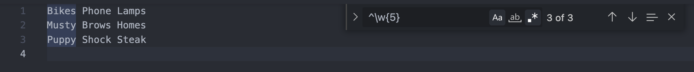
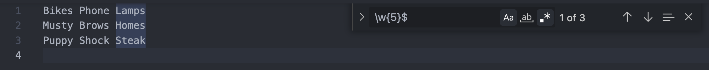

# Deciphering an Email Matching Regex

A regular expression, or more commonly called regex for short, is a sequence of characters that define a search pattern for a body of text, and is an important tool for developers. As you will soon see, they may seem cryptic and nonsensical at first. However, as with many coding concepts, regular expressions are very logical and are digestible when broken into its different components. In this tutorial, I will be reviewing a concept, providing at least one example of the concept, and then outlining that concept in our email matching regex expression. 

 ## Email Matching Regex Expression

 The following expression searches a body of text for an email address.

/^(\[a-z0-9_\\\.-\]+)@(\[\da-z\\\.-\]+)\\\.(\[a-z\\\.\]{2,6})$/

NOTE: Backslashes are added to the regex expression in this tutorial to escape markdown format. I encourage you to read this tutorial in the gist.md's preview or on Github for visual clarity. 

## Summary

This regex, or regular expression, searches and matches an email in a body of text. For the purpose of our expression, we will define an email address as a string composed of 3 parts. A username, a domain, and a domain extension. 

jeffreycodes42@UCIbootcamp.com

- Username- jeffreycodes42
- Domain- UCIbootcamp
- Extension- .com

## Table of Contents

- [Anchors](#anchors)
- [Quantifiers](#quantifiers)
- [Grouping Constructs](#grouping-constructs)
- [Bracket Expressions](#bracket-expressions)
- [Character Escapes](#character-escapes)

## Regex Components

### Anchors

Anchors are a type of meta characters that match the position of characters instead of characters themselves. The caret ^ symbol (when outside of square brackets) matches the start of a line of text.

In the code below, the regular expression '\w{5}' matches all 5 words characters in a row. 

However, if we precede our regex with a caret ^ anchor like in '^\w{5}', we will match 5 word characters in a row that only exist at beginning of a line. 

On the other hand, if we add the dollar $ anchor (outside of square brackets) at the end of our regex, we will match at the end of each line of text. 

The regular expression '/w{5}$', matches 5 word characters in a row that only exist at the end of a line.

### Our Anchors

Our email matching regex contains both of these anchors. 
There is a caret ^ anchor at the front of our regex that precedes the first group of parentheses.

-  ^(\[a-z0-9_\\\.-\]+)

Here we match all lowercase letters a to z, digits 0-9, underscores, dots, and hyphens at the beginning of a line or input. In our case, this makes up the username of the email address (i.e., jeffreycodes42).

We also have a dollar $ anchor that at the very end of regex. 

- \.(\[a-z\\\.\]{2,6})$/

We match a minimum of 2 and a maximum of 6 lowercase letters a to z and dots that are positioned at the end of a line of text or end of input. This makes up the domain extensions (e.g. com, net, org).

### Quantifiers

Quantifiers are used to modify metacharacters and detail how many characters or expressions we want to match in a row. 

**Quantifier Types**

The asterisk \* matches 0 or more of the preceding item(s).

In '/bo*/', the * modifies the literal character 'o'.
- Matches 'boooooo' in the word 'booooooed' since it matches literal character 'b' and then the 6 'o's that follow. 
- This also matches 'b' in the word 'bird' since * can also match no 'o's. 

The plus \+ matches 1 or more of the preceding item(s)

- In '/a+/', the + quantifies the literal character 'a'.
- This matches 'aaaaa' in 'speaaaaak' since there is one or more 'a' is found.

The question mark ? matches the preceding item 0 or 1 times.

- In '/colou?rs?/', the question mark ? quantifies the literal characters 'u' and 's', allowing us to match both spellings of color and its plurals.
- This regex will match c, o, l, o, u optionally, r, and s optionally.

{ min, max } matches the preceding item at least min times and at most max times.

- In '/ps{2,4}t/', the {2,4} quantifies the literal character 's'.
- We only match the pst if there are *at least* two 's's and *at most* four 's's.

{ n } matches the preceding item *n* times.

- In '/ps{3}t/', the {3} quantifies the literal character 's'.
- We only match  the pst if there are *exactly* three 's's. 

### Our Quantifiers

In our regex, we have three quantifiers: +, +, and {2,6}.

**Email Regex: /^(\[a-z0-9_\\\.-\]+)@(\[\da-z\\\.-\]+)\\\.(\[a-z\\\.\]{2,6})$/**

1. Our first plus quantifier modifies [a-z0-9_\\\.-\]. 
- One or more of the listed characters within the square brackets will match.
- Matches a combination of one or more letters a to z, numbers 0 to 9, underscores, dots, and hyphens.
- Ex: jeff, jeffrey81, jeffrey_sun_81, and jeffrey.sun_81

2. Our second plus quantifier modifies [\da-z\\\.-\]+.
- Similarly, this matches a combination of one or more of the listed characters within the square brackets.
- There may be one or more digit characters, letters a to z, dots, and hyphens.
- Ex: gmail, yahoo, outlook, and ucibootcamp

3. Our third quantifier details a minimum of 2 and maximum of 4 and modifies [a-z\\\.\].
- We only match at least 2 and at most 6 letters a to z and dots.
- Ex: com, org, edu, gov 

### Grouping Constructs

**Capturing Groups and Back References**

When using a regex, we often match multiple results. For example, in the regex '\d{3}-\d{3}-\d{4}', we would match the two phone numbers: 

1. 949-123-1234
2. 714-123-1234

Each match is automatically assigned a group with the first match, 949-123-1234, assigned as Group 1 and the second match, 714-123-1234, assigned as Group 2.

**Capturing Groups**

We are also able to form 'sub groups' by enclosing expressions in parentheses.
If we enclose each section of a phone number in parentheses like in '\d{3}-(\d{3})-(\d{4})', we are able to form 3 sub groups.

949-123-1234

Group 0: '949-123-1234' or the full match 

Group 1: '123' or the first sub group captured

Group 2: '1234' or the second sub group captured

**Referring to Groups / Subgroups**

We refer to these groups we can either use '$n' or '\n' where n = group number. 

- 

- All 3 phone numbers match in the above example.

- We only want the area code of each phone number before we redact the rest so we enclose the first 3 digits in parenthesese.

- Now that we've created a sub group with our parenthesese, we can target that group using $n.

- In our replace line, we refer to the first captured group using $1 and redact the rest of the numbers by replacing the with an X.

-  The following image is after we've clicked 'Replace All' 

**Backreference**

If we want to reference a captured group within our regex, we use \n where n = the captured group number.

- This example matches all words followed by a space character.

- If we want to find all duplicates in a row, we can add a backreference.

- We capture the first word with parenthesese '(\w+)', making it Group 1. Then we reference back to Group 1 with \n or '\1' for this example. 

- This regex searches for a word, followed by a space, and then the same word.

**Email Regex: /^(\[a-z0-9_\\\.-\]+)@(\[\da-z\\\.-\]+)\\\.(\[a-z\\\.\]{2,6})$/**

In our email regex, we have 4 groups divided by parenthesese. 

- Group 1: (\[a-z0-9_\\\.-\]+)

- Group 2: (\[\da-z\\\.-\]+)

- Group 3: (\[a-z\\\.\]{2,6})

Our fourth group, group 0, is the entire match. In our expression, we divide our three components of an email into groups but do not use $n nor \n. 

### Bracket Expressions

Bracket expressions are lists of characters that exist between  square brackets, matching any character listed inside. 

- Literal characters b, c, and d are inside the brackets meaning that we will match all letters b c and d.

- If we being our list with a caret ^, we will match all characters NOT listed as shown above.

Lastly, we can use hyphens in our brack expressions to describe ranges.

- We are matching characters b to d, meaning b, c, and d.

- We are also matching digits 3 to 5, meaning 3, 4, and 5.

**Email Regex: /^(\[a-z0-9_\\\.-\]+)@(\[\da-z\\\.-\]+)\\\.(\[a-z\\\.\]{2,6})$/**

We have three bracket expressions within our regex. 
1. [a-z0-9_\\\.-\]

We match letters that a to z, digits 0 to 9, underscores, dots, and hypens

2. [\da-z\\\.-\]

We match digit characters, letters a to z, dots, and hyphens.

3. [a-z\\\.\]

We match letters a to z and dots.

### Character Escapes

Character escapes are used to distinguish literal characters from characters that default a special meaning in regex.

We use precede any character we want to escape with a backslash \ .

Remember that the dot . is a metacharacter that matches any single character. 

- Dot by itself is matching every single character in the text above.

- If we escape the dot's special meaning using a backslash, we match all literal dots.

**Email Regex: /^(\[a-z0-9_\\\.-\]+)@(\[\da-z\\\.-\]+)\\\.(\[a-z\\\.\]{2,6})$/**

In our expression we escape the default special meaning of dots in the following snippets.
- [a-z0-9_\\\.-\]
- [\da-z\\\.-\]
- [a-z\\\.\]

In the above snippets, we are naming the dot as one of the listed characters inside our bracket expressions. We escape the dot's special meaning by preceding it with a backslash

Between the 2nd and 3rd group we have another character escape. 
- )\\\.(

We want to match the literal dot between the email provider (i.e., gmail) and the extension (i.e., com).

## Author

My name is Jeffrey and I'd like to thank you for reviewing my email matching regex tutorial! I am on my way to becoming a full stack developer and cannot wait to break into the tech industry! 

Check out more of my work down below:

[https://github.com/jffsun](https://github.com/jffsun)