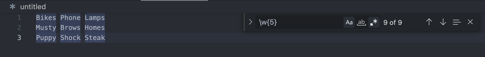
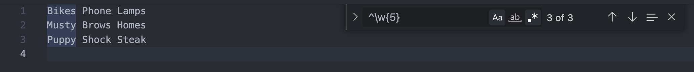
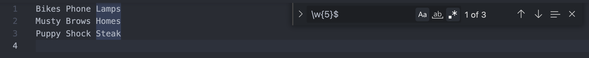

# Title (replace with your title)

Introductory paragraph (replace this with your text)

## Notes

- What: regex for short. a Tool. a sequence of characters that define a search pattern for a body of text. can find Literal or Meta (general) characters 
- Ex: Search for all phone numbers in body of text
- How: meta character '\d' = characters 0-9; for first 3 numbers of phone number (ie. 949-123-1234) => \d\d\d - \d\d\d - \d\d\d\d; 
- In the find bar, enable Regular expressions or Regex using the wildcard '.*' '.' means any character; "asterisk" is a quantifier meaning 0 or more.
- Sample Meta Characters
'\d' for digit = characters 0-9
'\w' for word = characters A-Z, a-z, and 0-9
'\s' for whitespace = space / tab
'.' = any character whatsoever

Examples above are lower case and capital letters represent the OPPOSITE of the search or ANYTHING NOT
'\D' = anything NOT a digit
'\W' = any characters NOT A-Z, a-z, or 0-9
'\S' = anything NOT whitespace

Quantifiers (how many)
- What: Modify metacharacters and detail HOW MANY characters we want to match in a row
- Sample Quantifiers
* = 0 or more
+ = 1 or more (at least one)
? = 0 or 1 
{ } = { min, max }
{ n } 

Meta Characters with Modifier Examples
- \w{5} = 5 word characters in row
- \s\w{5}\s = matches 5 word characters preceded and followed by a white space
- \w\d+ = word character followed by at least one digit
- colou?rs? = c, o, l, o, u (optional), r, s(optional)

Position (Position of Metacharacter in string)
- ^ beginning of a line
- $ end of a line
- \b word bounding

Position Examples: 
- ^\w+ = beginning of a line followed by at least one or more word characters

- \w+$ =  at the end of a line preceded by at least one or more word characters

- \w{4} matches any 4 word characters (numb)ers

- \b\w{4}\4 matches only 4 word characters 

- \d\d\d{3}-\d\d\d{3}-\d\d\d{4} matches 949-123-1234 

- \d\d\d{3}-?.?\d\d\d{3}-?.?\d\d\d{4} matches 949-123-1234 or 949.123.1234

 Character Classes [ ]
 - [ abc ] matches an a, b, or c
 - [ -. ] matches a dash or a dot. '.' represents the literal period and is a way of escaping the meta character
-  'l[yi]nk' matches lynk or link
- \d\d\d[-.]\d\d\d matches 949-123 or 949.123

- DISSECT: \(?\d{3}[-.)]\d{3}[-.]\d{4}
- \(?\ = literal open parenthesese OPTIONALLY | d{3} = 3 digit characters | [-.)] = either a dash, period, or close parenthesese | d{3} = 3 digit characters | [-.] = either dash or period | d{4}  = 4 digit characters

- [ - ] = matching a '-' in text since it is the first character in square bracket
- [ -. ] = matching a '-' or '.' in text since its the first character
- [ a-z ] = matching letters a thru z since it is not first character (NOTE: Can choose case sensitivity in text editor)
- [0-5]{3} = matching 3 characters in a row consisting of digits 0 thru 5
- [^0-5] = any characters NOT 0-5. '^' carrot symbol negates the character class
- [a^bc] = matches characters 'a', '^', 'b' 'c'
- [A-Z][a-z]+ = matches a single Upper Case Character followed by one or more lowercase characters so only Capital words

 Alternation ( | )
 - (net|com) = matches net or com 
 - [\w.]+@\w+\.(net|com) = matches one or more word characters OR '.' characters, followed by '@' followed by one or more word characters, followed by literal '.' followed by 'net' or 'com'

 ## Email Matching Regex Expression
 The following expression searches a body of text for an email address

/^([a-z0-9_\.-]+)@([\da-z\.-]+)\.([a-z\.]{2,6})$/

- [Anchors](#anchors)
Anchors are a type of meta characters that match the position of characters instead of characters themselves. The '^' or caret symbol (when outside of square brackets) matches the start of a line of text.

In the code below, the regular expression '\w{5}' matches all 5 words characters in a row. 

- However, if we precede our regex with a caret ^ anchor to form '^\w{5}', we will match 5 word characters in a row that only exist at beginning of a line. 

- The '$' symbol (when outside of square brackets) matches the end of a line of text. 
In the expression '/w{5}$', we will match 5 word characters in a row that only exist at the end of a line.

Our email matching regex contains both of these anchors. 
We have a caret (^) anchor that precedes '([a-z0-9_\.-]+)@', meaning our match must occur that all lowercase letters a through z, digits 0-9, underscores, dots, and hyphens before the @ symbol. 

- [Quantifiers](#quantifiers)
- [Grouping Constructs](#grouping-constructs)
- [Bracket Expressions](#bracket-expressions)
- [Character Classes](#character-classes)
- [The OR Operator](#the-or-operator)
- [Flags](#flags)
- [Character Escapes](#character-escapes)
We escape the default special behavior of the dot ([a-z0-9_\.-]+)

- Any number of letters a-z, digit 0-9, underscore, periods, or dashes

## Summary

Briefly summarize the regex you will be describing and what you will explain. Include a code snippet of the regex. Replace this text with your summary.

## Table of Contents

- [Anchors](#anchors)
- [Quantifiers](#quantifiers)
- [Grouping Constructs](#grouping-constructs)
- [Bracket Expressions](#bracket-expressions)
- [Character Classes](#character-classes)
- [The OR Operator](#the-or-operator)
- [Flags](#flags)
- [Character Escapes](#character-escapes)

## Regex Components

### Anchors

### Quantifiers

### Grouping Constructs

### Bracket Expressions

### Character Classes

### The OR Operator

### Flags

### Character Escapes

## Author

A short section about the author with a link to the author's GitHub profile (replace with your information and a link to your profile)
